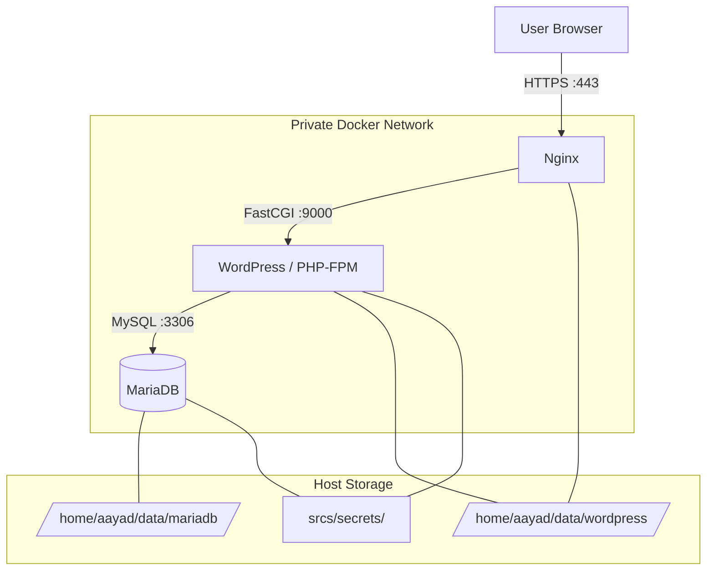

# User Documentation

## What This Stack Provides

This project runs a small web stack made of three services:

* Nginx acts as the public entry point and serves the website over HTTPS.
* WordPress provides the website and administration interface.
* MariaDB stores the WordPress database.

Only Nginx is exposed to the outside world. WordPress and MariaDB stay inside the private Docker network.

## Architecture

The application is designed as a simple three-layer stack:



1. The browser connects to Nginx on port 443 using HTTPS.
2. Nginx forwards WordPress requests to the WordPress container.
3. WordPress reads and writes data in MariaDB through the private Docker network.

The stack keeps each service isolated in its own container, which makes it easier to restart, debug, and replace one part without affecting the others.

Data is stored outside the containers so it survives restarts and rebuilds:

* MariaDB data is stored on the host under `/home/aayad/data/mariadb`.
* WordPress files are stored on the host under `/home/aayad/data/wordpress`.

Secrets are kept in `srcs/secrets/` and are read when the containers start.

## Start And Stop The Project

Before starting the stack, make sure the required secrets and environment file are present under `srcs/`:

* `srcs/secrets/db_root_password.txt`
* `srcs/secrets/db_password.txt`
* `srcs/secrets/wordpress_admin_password.txt`
* `srcs/secrets/wordpress_password.txt`
* `srcs/.env`

From the repository root, use the Makefile:

```bash
make up
```

This creates the persistent data folders if needed and starts the containers in the background.

To stop the project without deleting data, run:

```bash
make down
```

To remove the containers, volumes, and local data used by the stack, run:

```bash
make clean
```

## Access The Website And Administration Panel

The website is available over HTTPS at the domain configured in `srcs/.env`. With the default setup, open:

* https://aayad.42.fr

The WordPress administration panel is available at:

* https://aayad.42.fr/wp-admin

If the site does not open, check that the domain name is mapped to `127.0.0.1` in `/etc/hosts`.

## Credentials And Secrets

The project uses secret files stored in `srcs/secrets/`.

* `db_root_password.txt` contains the MariaDB root password.
* `db_password.txt` contains the WordPress database user password.
* `wordpress_admin_password.txt` contains the WordPress administrator password.
* `wordpress_password.txt` contains the password for the additional WordPress user.

These files are read by the containers at startup. If you need to change a password, update the matching file and restart the stack with `make down` followed by `make up`.

## Check That The Services Are Running

Use Docker to confirm that the containers are up:

```bash
docker compose -f srcs/docker-compose.yml ps
```

You should see the `nginx`, `wordpress`, and `mariadb` containers running.

You can also test the website in a browser or by checking that HTTPS responds on port 443.

## What To Expect When Everything Works

* The WordPress homepage opens in the browser.
* The administration panel accepts the administrator credentials.
* The containers stay running after startup unless a configuration error occurs.

